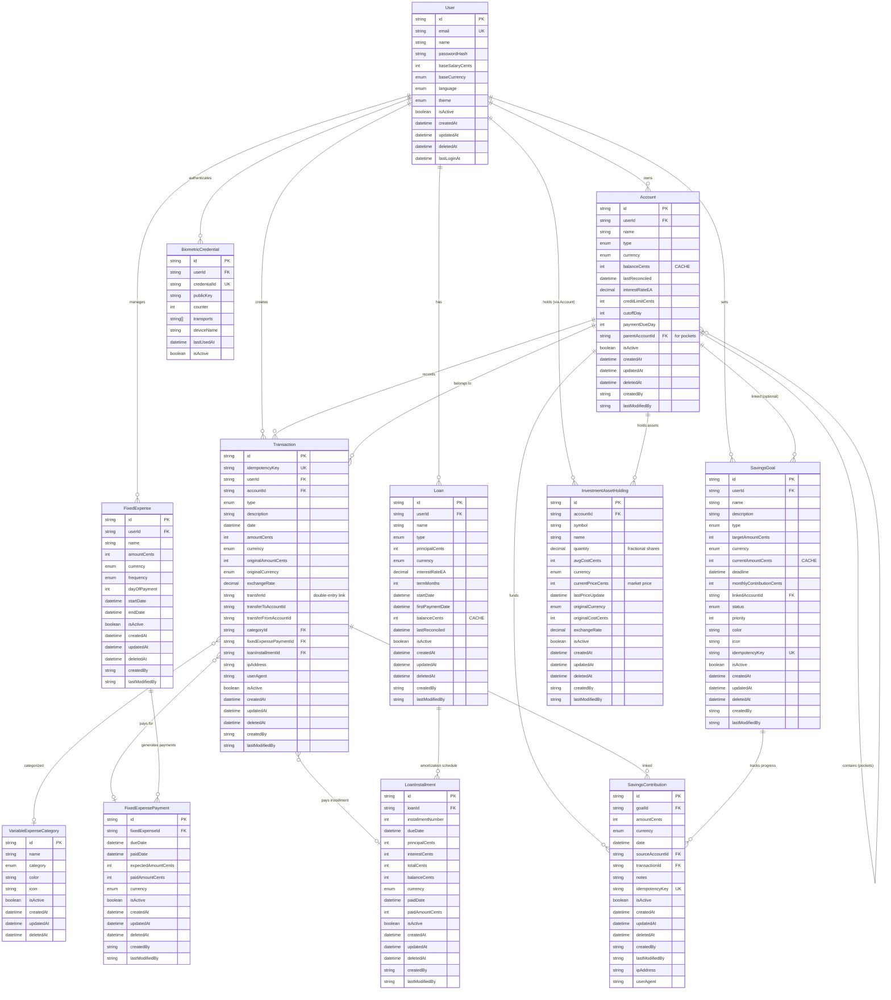

# Database Architecture - FinanceTrackerPro

## Environments

FinanceTrackerPro uses **three fully isolated PostgreSQL containers** (see `docker-compose.postgres.yml`):

| Container                      | Host Port | Database                      | Purpose                |
| ------------------------------ | --------- | ----------------------------- | ---------------------- |
| `financetracker-postgres`      | `5432`    | Configurable via `.env`       | Development            |
| `financetracker-postgres-e2e`  | `5433`    | `financetracker-postgres-e2e` | E2E tests (Playwright) |
| `financetracker-postgres-test` | `5434`    | `financetrackerpro_test`      | Integration tests      |

- Dev data never leaks into tests — each environment uses its own container.
- The E2E database is wiped and re-seeded automatically by `e2e/global-setup.ts` before each run.
- Integration tests point at the test database via `vitest.db-setup.ts` (top-level `DATABASE_URL` override).

## Entity Relationship Diagram



## Core Models

### User

Central entity for authentication and configuration.

**Key Fields**:

- `baseSalaryCents`: Monthly salary in cents for budget calculations
- `baseCurrency`: Primary currency (COP, USD, EUR)
- `language`: UI language preference
- `theme`: Dark/Light/System

**Relations**:

- Owns multiple accounts (savings, investment, credit cards)
- Creates all transactions
- Manages fixed expenses and loans
- Authenticates via biometric credentials

### Account

Financial accounts with hierarchical support (pockets).

**Types**:

- `SAVINGS`: Cuenta de Ahorros
- `INVESTMENT`: Cuenta de Inversión
- `CREDIT_CARD`: Tarjeta de Crédito
- `POCKET`: Sub-account (bolsillo)

**Key Fields**:

- `balanceCents`: **CACHE** - Reconciled from transaction history
- `lastReconciled`: Last reconciliation timestamp
- `interestRateEA`: Effective Annual Rate (20,8 precision)
- `parentAccountId`: For pocket hierarchy (self-referencing)

**Pockets Logic**:

- Independent balance (not summed to parent)
- Own transaction history
- Separate reconciliation

### Transaction (Source of Truth)

Core entity implementing **double-entry bookkeeping**.

**Types**:

- `INCOME`: Income
- `EXPENSE`: Expense
- `TRANSFER_OUT`: Transfer debit (paired)
- `TRANSFER_IN`: Transfer credit (paired)
- `INVESTMENT`: Investment
- `LOAN_PAYMENT`: Loan payment
- `CREDIT_PAYMENT`: Credit card payment

**Key Fields**:

- `idempotencyKey`: UUID v4 for network safety (unique)
- `amountCents`: Final amount in cents
- `currency`: ISO 4217 code
- `originalAmountCents`: Pre-conversion amount
- `originalCurrency`: Source currency
- `exchangeRate`: Conversion rate (20,8 precision)
- `transferId`: Links paired transfer transactions
- `ipAddress`: Client IP for audit
- `userAgent`: Client agent for audit

**Indexes**:

- `userId`, `accountId`, `type`, `date` (queries)
- `isActive` (soft delete filter)
- `idempotencyKey` (duplicate prevention)
- `transferId` (paired transaction lookup)

### InvestmentAssetHolding

Stock positions per investment account.

**Key Fields**:

- `symbol`: Ticker (e.g. `AAPL`), unique per account
- `quantity`: `Decimal(20, 8)` — supports fractional shares
- `avgCostCents`: Average purchase cost in cents
- `currentPriceCents`: Last known market price (updated by price service)
- `originalCostCents` / `originalCurrency` / `exchangeRate`: Currency traceability (Rule 11)

**Constraint**: `@@unique([accountId, symbol])` — one position per symbol per account.

### SavingsGoal

Savings targets with progress tracking.

**Key Fields**:

- `targetAmountCents`: Goal in cents
- `currentAmountCents`: **CACHE** — reconciled from contributions
- `monthlyContributionCents`: Planned monthly contribution (used by max-spendable calc)
- `status`: `ACTIVE` | `COMPLETED` | `CANCELLED`
- `linkedAccountId`: Optional linked savings account
- `idempotencyKey`: UUID v4 for network safety

### SavingsContribution

Individual deposits into a savings goal.

**Key Fields**:

- `amountCents`: Contribution in cents
- `sourceAccountId`: Optional bank account the funds came from
- `transactionId`: Optional link to the created `Transaction`
- `idempotencyKey`: UUID v4 for network safety

**Note**: `currentAmountCents` is a cache — the true balance is the sum of active contributions (Rule 13).

## Double-Entry Bookkeeping

### Transfer Implementation

Transfers use **double-entry accounting** principles:

**Traditional Approach** (eliminated):

```sql
-- Single Transfer record
INSERT INTO Transfer (fromAccountId, toAccountId, amount)
```

**Double-Entry Approach** (implemented):

```sql
-- Transaction 1: Debit source
INSERT INTO Transaction (
  accountId, type, amountCents, transferId
) VALUES (
  'account-A', 'TRANSFER_OUT', -10000, 'uuid-123'
);

-- Transaction 2: Credit destination
INSERT INTO Transaction (
  accountId, type, amountCents, transferId
) VALUES (
  'account-B', 'TRANSFER_IN', 10000, 'uuid-123'
);
```

### Benefits

1. **Balance Integrity**: Sum of paired transactions = 0
2. **Complete History**: Each account has full transaction log
3. **Audit Trail**: Both entries linked by `transferId`
4. **Reconciliation**: Compute balance from own transactions only
5. **Rollback Safety**: Atomic delete (both or neither)

### Example: Transfer $100 USD

```typescript
const transferId = crypto.randomUUID();

await prisma.$transaction([
  // Debit source account
  prisma.transaction.create({
    data: {
      idempotencyKey: crypto.randomUUID(),
      userId: 'user-1',
      accountId: 'savings-account',
      type: 'TRANSFER_OUT',
      amountCents: -10000, // Negative
      currency: 'USD',
      transferId,
      transferToAccountId: 'investment-account',
      date: new Date(),
    },
  }),

  // Credit destination account
  prisma.transaction.create({
    data: {
      idempotencyKey: crypto.randomUUID(),
      userId: 'user-1',
      accountId: 'investment-account',
      type: 'TRANSFER_IN',
      amountCents: 10000, // Positive
      currency: 'USD',
      transferId,
      transferFromAccountId: 'savings-account',
      date: new Date(),
    },
  }),
]);
```

## Reconciliation Logic

### Account Balance = CACHE

`Account.balanceCents` is a **read cache**. Source of truth = transaction history.

**Computation**:

```typescript
async function computeTrueBalance(accountId: string): Promise<number> {
  const transactions = await prisma.transaction.findMany({
    where: { accountId, isActive: true },
    select: { amountCents: true, type: true },
  });

  let balance = 0;

  for (const tx of transactions) {
    // All amounts already have correct sign
    // TRANSFER_OUT: negative
    // TRANSFER_IN: positive
    // INCOME: positive
    // EXPENSE: negative (stored as negative)
    balance += tx.amountCents;
  }

  return balance;
}
```

**Reconciliation**:

```typescript
async function reconcileAccount(accountId: string) {
  const trueBalance = await computeTrueBalance(accountId);
  const account = await prisma.account.findUnique({
    where: { id: accountId },
  });

  if (account.balanceCents !== trueBalance) {
    // Fix cache
    await prisma.account.update({
      where: { id: accountId },
      data: {
        balanceCents: trueBalance,
        lastReconciled: new Date(),
      },
    });

    // Alert discrepancy
    console.error('Balance discrepancy', {
      accountId,
      cached: account.balanceCents,
      computed: trueBalance,
      diff: account.balanceCents - trueBalance,
    });
  }
}
```

### Pocket Balance

For `POCKET` type accounts:

- Balance computed from **own transactions only**
- Not included in parent account reconciliation
- Independent `lastReconciled` timestamp

## Currency Conversion Tracking

### Multi-Currency Support

Every transaction stores conversion details:

```typescript
// User pays 100 EUR, account in USD
await prisma.transaction.create({
  data: {
    amountCents: 11000, // $110 USD (final)
    currency: 'USD',
    originalAmountCents: 10000, // €100 (original)
    originalCurrency: 'EUR',
    exchangeRate: new Decimal('1.10'), // EUR→USD rate
  },
});
```

**Validation**:

```typescript
if (tx.currency !== tx.originalCurrency) {
  // Conversion detected
  assert(tx.exchangeRate !== null, 'Exchange rate required');
  assert(tx.originalAmountCents !== null, 'Original amount required');

  // Verify math
  const computed = new Decimal(tx.originalAmountCents)
    .times(tx.exchangeRate)
    .toDecimalPlaces(0, Decimal.ROUND_HALF_EVEN);

  assert(computed.toNumber() === tx.amountCents, 'Conversion mismatch');
}
```

## Loan Amortization

### Loan Model

**Fields**:

- `principalCents`: Original loan amount
- `interestRateEA`: Effective Annual Rate (20,8 precision)
- `termMonths`: Loan duration
- `balanceCents`: **CACHE** - Remaining balance

### LoanInstallment Model

Pre-calculated amortization table:

**Fields**:

- `installmentNumber`: 1, 2, 3, ...
- `principalCents`: Principal payment
- `interestCents`: Interest payment
- `totalCents`: Total payment (principal + interest)
- `balanceCents`: Remaining balance after this payment
- `dueDate`: Expected payment date
- `paidDate`: Actual payment date (null = unpaid)

**Generation** (at loan creation):

```typescript
function generateAmortizationSchedule(
  principal: number,
  rateEA: Decimal,
  termMonths: number
): LoanInstallment[] {
  const monthlyRate = rateEA.dividedBy(12).dividedBy(100);
  let balance = principal;
  const installments: LoanInstallment[] = [];

  for (let i = 1; i <= termMonths; i++) {
    const interest = new Decimal(balance)
      .times(monthlyRate)
      .toDecimalPlaces(0, Decimal.ROUND_HALF_EVEN)
      .toNumber();

    const principal = totalPayment - interest;
    balance -= principal;

    installments.push({
      installmentNumber: i,
      principalCents: principal,
      interestCents: interest,
      totalCents: totalPayment,
      balanceCents: balance,
      dueDate: calculateDueDate(i),
    });
  }

  return installments;
}
```

## Fixed Expenses

### Recurring Payment Tracking

**FixedExpense**: Template (e.g., "Rent", $1500, Monthly)  
**FixedExpensePayment**: Individual payment records

**Workflow**:

1. Create `FixedExpense` with frequency
2. System generates `FixedExpensePayment` records (due dates)
3. User pays → Creates `Transaction` linked to payment
4. `FixedExpensePayment.paidDate` updated

**Avoids**: Checkbox overwrite (lost history)  
**Enables**: Payment history, late payment tracking

## Indexes & Performance

### Critical Indexes

**User queries**:

```sql
@@index([userId])       -- All user data
@@index([isActive])     -- Soft delete filter
```

**Transaction queries**:

```sql
@@index([accountId])       -- Account transactions
@@index([date])            -- Date range queries
@@index([type])            -- Transaction type filter
@@index([transferId])      -- Paired transfers
@@index([idempotencyKey])  -- Duplicate check
```

**Loan queries**:

```sql
@@index([loanId])     -- Installments by loan
@@index([dueDate])    -- Upcoming payments
```

### Composite Index Opportunities

```prisma
// Future optimization
@@index([userId, isActive, date(sort: Desc)])
@@index([accountId, type, isActive])
```

## Precision & Rounding

### Storage

- Money: **Integer cents** (no floats)
- Exchange rates: `Decimal(20, 8)`
- Interest rates: `Decimal(20, 8)`

### Calculations

- Library: **Decimal.js**
- Rounding: **ROUND_HALF_EVEN** (Banker's rounding)
- Precision: 20 decimal places

### Banker's Rounding

```typescript
divideCents(100, 3); // 33 (rounds to even)
divideCents(200, 3); // 67 (rounds to even)
```

Reduces cumulative rounding bias.

## Security & Audit

### Soft Deletes

All financial models include:

```prisma
isActive   Boolean  @default(true)
deletedAt  DateTime?
```

**Never** physical delete. Queries MUST filter `isActive: true`.

### Audit Trail

All mutations track:

```prisma
createdAt      DateTime @default(now())
updatedAt      DateTime @updatedAt
createdBy      String?
lastModifiedBy String?
```

### Extended Audit (Critical Operations)

Transactions and transfers include:

```prisma
ipAddress  String?  // Client IP
userAgent  String?  // Browser/app
```

**Use cases**:

- Fraud detection
- Security forensics
- Compliance (PCI-DSS)
- Rate limiting

## Constraints & Validation

### Database Level

```sql
-- Positive balances (TODO: Add in migration)
ALTER TABLE "Account"
ADD CONSTRAINT check_balance_non_negative
CHECK (type != 'LOAN' OR balanceCents <= 0);

-- Valid day ranges
ALTER TABLE "Account"
ADD CONSTRAINT check_cutoff_day_range
CHECK (cutoffDay >= 1 AND cutoffDay <= 31);
```

### Application Level

Zod schemas enforce:

- UUID v4 format for `idempotencyKey`
- Positive `amountCents` for income/expense
- ISO 4217 currency codes
- CUID format for all IDs

## Migration Strategy

### Initial Setup

```bash
# Dev: Apply migrations
npm run db:migrate

# Prod: Apply pending migrations without prompts
npx prisma migrate deploy
```

### Data Migration

When adding conversion tracking to existing data:

```typescript
// Backfill missing conversion fields
await prisma.transaction.updateMany({
  where: {
    currency: { not: null },
    originalCurrency: null,
  },
  data: {
    originalCurrency: {
      /* copy from currency */
    },
    originalAmountCents: {
      /* copy from amountCents */
    },
    exchangeRate: new Decimal('1.0'),
  },
});
```

## Query Examples

### Get Account Balance with Transactions

```typescript
const account = await prisma.account.findUnique({
  where: { id: accountId },
  include: {
    transactions: {
      where: { isActive: true },
      orderBy: { date: 'desc' },
      take: 10,
    },
  },
});
```

### Find Paired Transfer

```typescript
const [debit, credit] = await prisma.transaction.findMany({
  where: { transferId: 'uuid-123', isActive: true },
  orderBy: { amountCents: 'asc' }, // debit first (negative)
});
```

### Upcoming Loan Payments

```typescript
const upcoming = await prisma.loanInstallment.findMany({
  where: {
    loan: { userId, isActive: true },
    paidDate: null,
    dueDate: { lte: addDays(new Date(), 30) },
  },
  orderBy: { dueDate: 'asc' },
  include: { loan: { select: { name: true } } },
});
```

### Unpaid Fixed Expenses

```typescript
const unpaid = await prisma.fixedExpensePayment.findMany({
  where: {
    fixedExpense: { userId, isActive: true },
    paidDate: null,
    dueDate: { lte: new Date() },
  },
  include: {
    fixedExpense: { select: { name: true, amountCents: true } },
  },
});
```

## Future Enhancements

### Potential Additions

1. **Tags/Labels**: Many-to-many with transactions
2. **Budgets**: Monthly spending limits per category
3. **Recurring Investments**: Auto-invest schedules
4. **Multi-User Accounts**: Shared accounts (family)
5. **Import/Export**: CSV, OFX, QIF formats
6. **Notifications**: Payment reminders, low balance alerts

### Performance Optimizations

1. **Materialized Views**: Pre-computed summaries
2. **Read Replicas**: Separate read/write databases
3. **Caching Layer**: Redis for hot data
4. **Archival**: Move old transactions to cold storage
5. **Partitioning**: Partition transactions by date

## References

- **CLAUDE.md**: 14 Financial Integrity Rules
- **README.md**: Project overview and setup
- **Prisma Docs**: https://prisma.io/docs
- **Double-Entry**: https://en.wikipedia.org/wiki/Double-entry_bookkeeping
